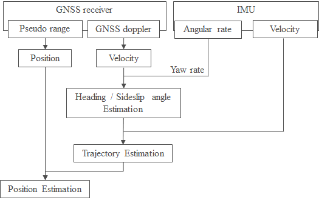

 (Alpha version)

[Demo Video](https://youtu.be/u8Nan38BkDw)

## What is Eagleye

Eagleye is an open-source software for vehicle localization utilizing GNSS and IMU[[1]](https://www.researchgate.net/publication/329619280_Low-cost_Lane-level_Positioning_in_Urban_Area_Using_Optimized_Long_Time_Series_GNSS_and_IMU_Data). Eagleye provides highly accurate and stable vehicle position and orientation by using GNSS Doppler[[2]](https://www.jstage.jst.go.jp/article/jsaeronbun/44/1/44_20134048/_article/-char/en)[[3]](https://www.jstage.jst.go.jp/article/jsaeijae/3/2/3_20124032/_article/-char/ja)[[4]](https://ieeexplore.ieee.org/document/6236946)[[5]](https://www.researchgate.net/publication/290751834_Automotive_positioning_based_on_bundle_adjustment_of_GPS_raw_data_and_vehicle_trajectory)[[6]](https://ci.nii.ac.jp/naid/10029931657/). The flowchart of the algorithm is shown in the figure below. The algorithms in this software are based on the outcome of the research undertaken by [Machinery Information Systems Lab (Meguro Lab)](https://www2.meijo-u.ac.jp/~meguro/index.html) in Meijo University.

## Getting started

### Hardware
**GNSS receiver**
* [Ublox NEO-M8T](https://www.u-blox.com/en/product/neolea-m8t-series) / [EVK-M8T](https://www.u-blox.com/product/evk-8evk-m8)
* [Ublox ZED-F9P](https://www.u-blox.com/en/product/zed-f9p-module) / [C099-F9P](https://www.u-blox.com/en/product/c099-f9p-application-board)

**GNSS Antenna**

* [Ublox ANN-MB Series](https://www.u-blox.com/en/product/ann-mb-series)
* [Tallysman TW2710](http://www.tallysman.com/index.php/gnss/products/antennas-gpsbeidougalileoglonass/tw2710/)

**IMU**
* [Tamagawa Seiki TAG300 Series](http://mems.tamagawa-seiki.com/en/product/)
* [ANALOG DEVICES ADIS16475](https://www.analog.com/products/adis16475.html#product-overview)

**Wheel speed sensor**

Eagleye uses vehicle speed acquired from CAN bus.

### Prerequisites

1. Clone and Build MapIV's fork of [RTKLIB](https://github.com/MapIV/RTKLIB/tree/rtklib_ros_bridge). You can find more details about RTKLIB [here](http://www.rtklib.com/).

		cd $HOME  
		git clone -b rtklib_ros_bridge https://github.com/MapIV/RTKLIB.git
		cd $HOME/RTKLIB/lib/iers/gcc/  
		make   
		cd $HOME/RTKLIB/app  
		make   

2. Clone and build [rtklib_ros_bridge](https://github.com/MapIV/rtklib_ros_bridge).

		cd $HOME/catkin_ws/src  
		git clone https://github.com/MapIV/rtklib_ros_bridge.git  
		cd ..  
		catkin_make -DCMAKE_BUILD_TYPE=Release  

3. Clone and build [nmea_navsat_driver](https://github.com/MapIV/nmea_navsat_driver.git).

		cd $HOME/catkin_ws/src  
		git clone https://github.com/MapIV/nmea_navsat_driver.git  
		cd ..  
		catkin_make -DCMAKE_BUILD_TYPE=Release  

4. RTKLIB settings.

Change `inpstr1-path` of `$HOME/RTKLIB/app/rtkrcv/conf/rtklib_ros_bridge_sample.conf` according to the serial device you use.

ie)
>inpstr1-path =/serial/by-id/usb-u-blox_AG_-_www.u-blox.com_u-blox_GNSS_receiver-if00:230400:8:n:1:off  

5. nmea_navsat_driver settings.  

Change `arg name="port"` of `$HOME/catkin_ws/src/nmea_navsat_driver/launch/f9p_nmea_serial_driver.launch` according to the serial device you use.

ie)
>\<arg name="port" default="/dev/serial/by-id/usb-FTDI_FT232R_USB_UART_AG0JNPDS-if00-port0" />

6. GNSS receiver settings.
Configure the receiver settings using [u-center](https://www.u-blox.com/product/u-center).

* UART1(Connect to RTKLIB) Enable UBX message (output rate 5Hz, baudrate 230400) ※ Set to output only RAWX and SFRBX
* UART2(Connect to nmea_navsat_driver) Enable NMEA message (output rate 1Hz, baudrate 115200) ※ Set to output only GGA and RMC

Further details will be provided later.

7. IMU settings.

* Output rate 50Hz

8. Check the rotation direction of z axis of IMU being used. If you look from the top of the vehicle, if the left turn is positive, set "reverse_imu" to `true` in `eagleye/launch/eagleye_localization.launch`.

		param name="/eagleye/reverse_imu" type="bool" value="true"

### Running eagleye node

1. Check if wheel speed (vehicle speed) is published in `/can_twist` topic.

* Topic name: /can_twist
* Message type: geometry_msgs/TwistStamped twist.liner.x

2. Check if the IMU data is published in `/imu_raw` topic.

3. Start RTKLIB.

		cd $HOME/RTKLIB
		bash rtklib_ros_bridge_sample.sh

4. Check if RTKLIB is working by execute the following command in the terminal. If the RTKLIB is working correctly, positioning information is appeared continuously in the terminal.

		status 0.1  

5. Start rtklib_ros_bridge.

		rosrun rtklib_bridge rtklib_bridge   

6. Start nmea_navsat_driver.

		rosrun nmea_navsat_driver f9p_nmea_serial_driver.launch   

7. Start eagleye.

		roslaunch eagleye_rt eagleye_rt.launch

## Sample data

Sample data to test Eagleye is available from [here](https://www.dropbox.com/s/4757p5m1qk4iuub/eagleye_sample.bag?dl=0). This sample data is collected along this [route](https://www.google.com/maps/d/u/0/embed?mid=1pK4BgrGtoo14nguArDf-rZDqIL5Cg-v5) in Nagoya. The 3D maps of the route is also available as [Autoware sample data](https://drive.google.com/file/d/1Uwp9vwvcZwaoZi4kdjJaY55-LEXIzSxf/view).

### How to try the sample data

1. Play the sample data.  

		rosparam set use_sim_time true
		rosbag play --clock eagleye_sample.bag

2. Launch eagleye.  

		roslaunch eagleye_rt eagleye_rt.launch

The estimated results will be output about 100 seconds after playing the rosbag. This is because we need to wait for the data to accumulate for estimation.

## Research Papers for Citation
1. J Meguro, T Arakawa, S Mizutani, A Takanose, "Low-cost Lane-level Positioning in Urban Area Using Optimized Long Time Series GNSS and IMU Data", International Conference on Intelligent Transportation Systems(ITSC), 2018 [Link](https://www.researchgate.net/publication/329619280_Low-cost_Lane-level_Positioning_in_Urban_Area_Using_Optimized_Long_Time_Series_GNSS_and_IMU_Data)

1. Takeyama Kojiro, Kojima Yoshiko, Meguro Jun-ichi, Iwase Tatsuya, Teramoto Eiji, "Trajectory Estimation Based on Tightly Coupled Integration of GPS Doppler and INS" -Improvement of Trajectory Estimation in Urban Area-, Transactions of Society of Automotive Engineers of Japan   44(1) 199-204, 2013 [Link](https://www.jstage.jst.go.jp/article/jsaeronbun/44/1/44_20134048/_article/-char/en)

1. Junichi Meguro, Yoshiko Kojima, Noriyoshi Suzuki, Teramoto Eiji, "Positioning Technique Based on Vehicle Trajectory Using GPS Raw Data and Low-cost IMU", International Journal of Automotive Engineering 3(2) 75-80,  2012 [Link](https://www.jstage.jst.go.jp/article/jsaeijae/3/2/3_20124032/_article/-char/ja)

1. K Takeyama, Y Kojima, E Teramoto, "Trajectory estimation improvement based on time-series constraint of GPS Doppler and INS in urban areas", IEEE/ION Position, Location and Navigation Symposium(PLANS), 2012 [Link](https://ieeexplore.ieee.org/document/6236946)

1. Junichi Meguro, Yoshiko Kojima, Noriyoshi Suzuki, Eiji Teramoto, "Automotive Positioning Based on Bundle Adjustment of GPS Raw Data and Vehicle Trajectory", International Technical Meeting of the Satellite Division of the Institute of Navigation (ION), 2011 [Link](https://www.researchgate.net/publication/290751834_Automotive_positioning_based_on_bundle_adjustment_of_GPS_raw_data_and_vehicle_trajectory)

1. Yoshiko Kojima, et., al., "Precise Localization using Tightly Coupled Integration based on Trajectory estimated from GPS Doppler", International Symposium on Advanced Vehicle Control(AVEC), 2010 [Link](https://ci.nii.ac.jp/naid/10029931657/)

## License
Eagleye is provided under the [BSD 3-Clause](https://github.com/MapIV/eagleye/blob/master/LICENSE) License.

## Contacts

If you have further question, email to map4@tier4.jp.
